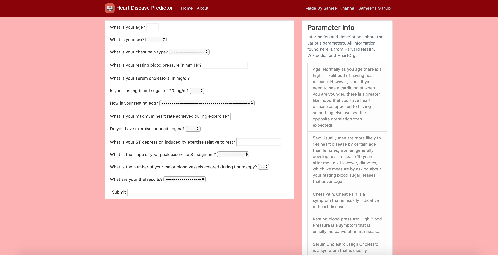
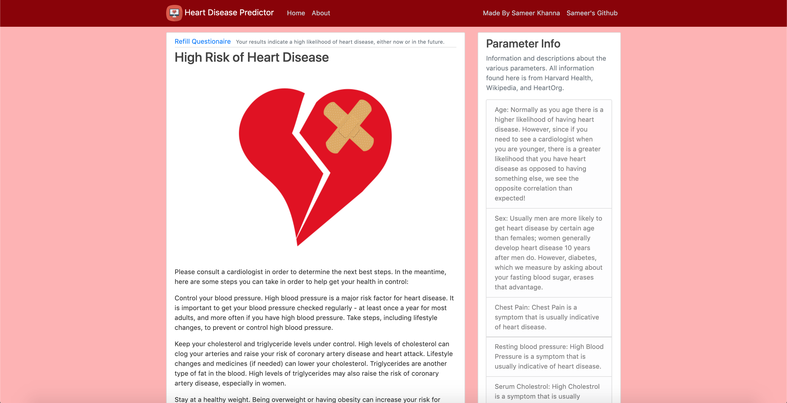
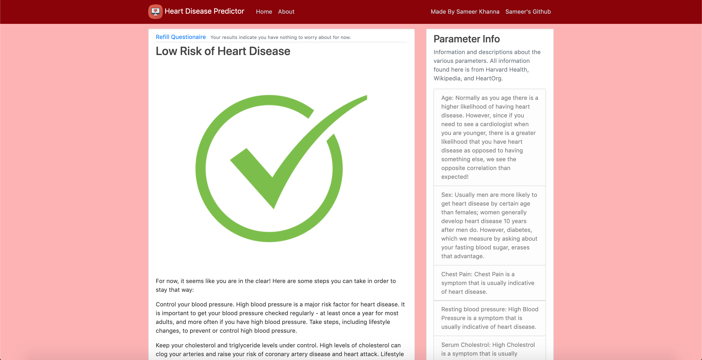
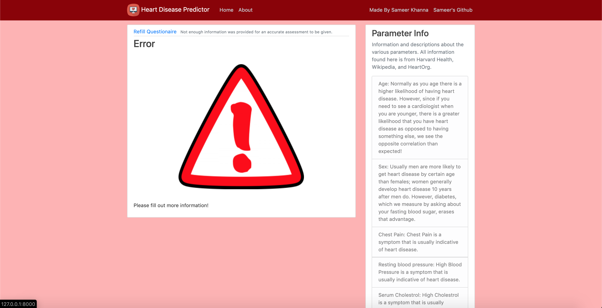
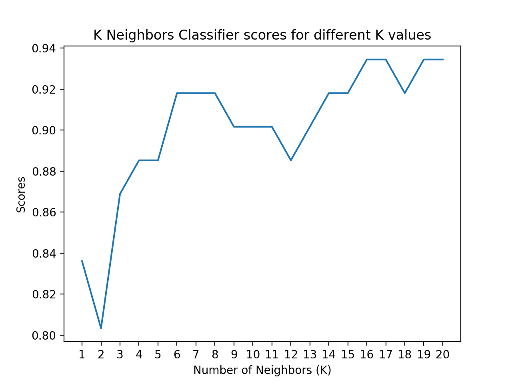
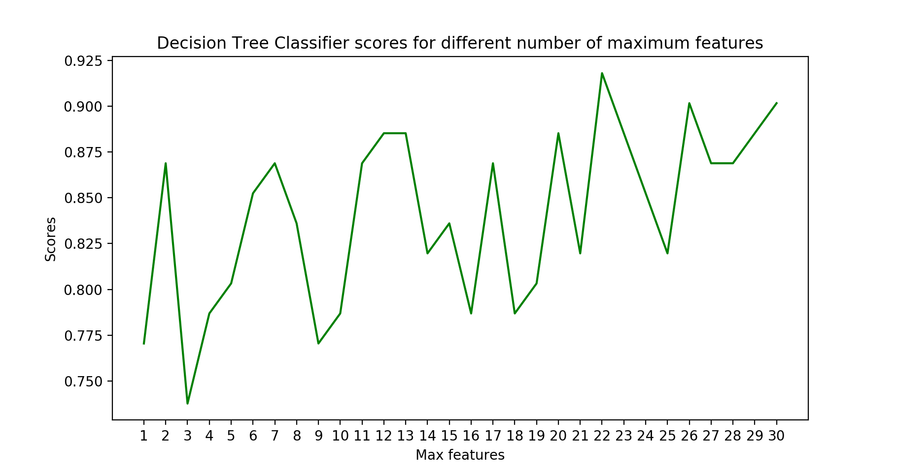
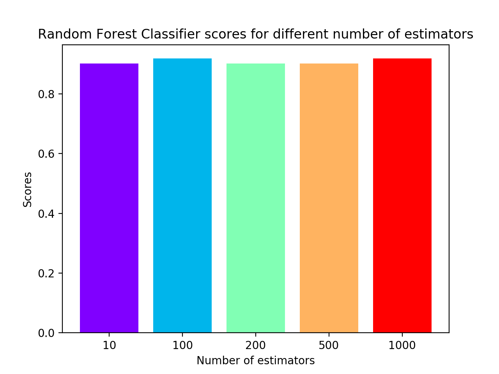
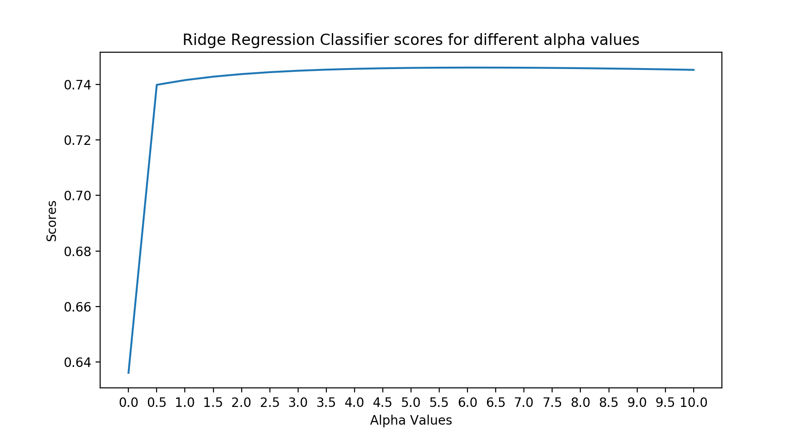
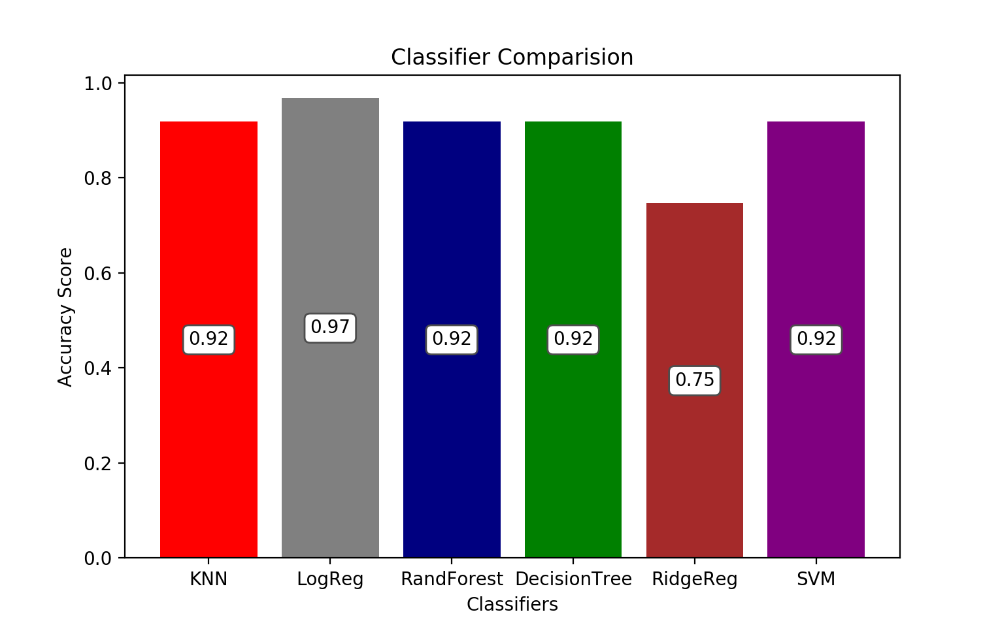

# PredictHeartDisease
Fill out a form and see if you have heart disease through the power of Machine Learning! 
 
This predictor is a logistic regression based prediction scheme. The classifier was chosen from a variety of canidates ranging from KNN, to OLS, to RR, to even binary perceptrons.

The database used to train the classifier is the UCI Heart Disease database, with 303 patients' data anonymized. The database has a total of 14 parameters (not including presence of heart disease), all of which are used in the analysis. Descriptions of each of the parameters can be found in the sidebar to the right.

You do not need to fill out all of the form's data. The classifier retrains itself if not all of the data is given in order to give as accurate a result as possible. However, the more data you provide, the better the results are.

## How it works
When you first load up the page, you are greeted by a page that includes a form asking for a variety of variables. Want to know what each value means and how it helps us predict if you have heart disease? The sidebar on the right has all of this information.

If the classifier predicts you have heart disease, this is the page you will see. It includes information on how to rectify this situation and get your life on track.

If the classifier predicts you don't have heart disease, this is the page you will see. It includes information on how to make sure things stay this way!

If you didn't provide enough information for the classifier to make an accurate assessment, this is the page you will see:

Want to know about how it works? Check the About page!

 
## Data Analysis
 
First, we need to get a grasp of the data in order to understand what we are working with.

Doesn't seem like we learn much about the data by simply plotting it. Lets plot the correlation matrix.

There do not seem to be strong correlations between any parameter and the target. This makes sense as there isn't one thing that guarantees that you either have or do not have heart disease. Lets see if we can gleam some information from the histograms for each data point.

There seems to be two different types of data we can see here. One type is organized into classes; for example Ca is organized into unique values. The other type follows a standard distribution with a range of values. We should handle the former type via dummy variables, and the latter by scaling.

## Classifier Testing

Not all classifiers are equal; some are better suited for certain jobs. For this project, I decided to compare KNN, OLS (via RR with alpha = 0), RR, DT, RF and LogReg.

Some of these classifiers have parameters that affect their accuracy. Before comparing them against one another, we first need to optimize these classifiers themselves.

Now that we have optimized each classifier, it is time to compare them against one another!

As can be seen here, we find LogReg, or Logistic Regression, is the best classifier with an accuracy of 95%! This is the classifier we used to analyze our forms.
